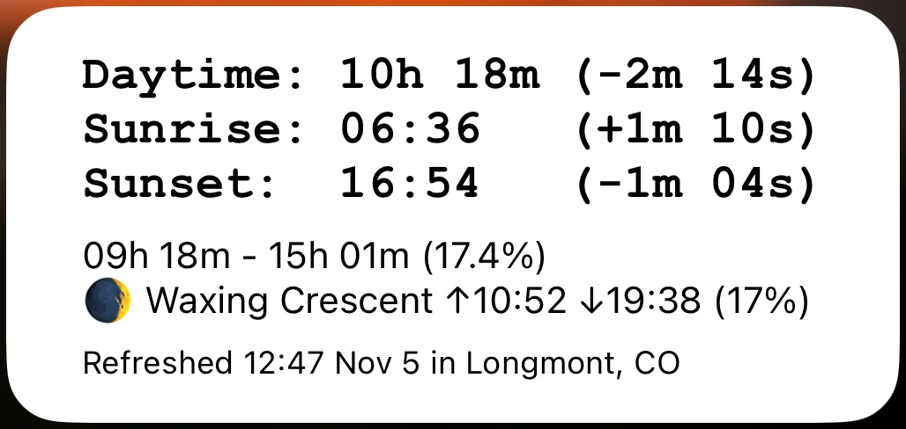

# Soluna

This is a [Scriptable](https://scriptable.app) script that makes a widget with
various info about the sun, moon, and day length. I made it because all similar
apps I tried were ad-filled, require you to sign up for a premium subscription,
or just weren't customizable enough to show the exact info I want to see.

 

The widget shows:

- The current day length, and the difference from yesterday
- The current sunrise/sunset times, and the differences from yesterday
- The yearly min and max day lengths, and the "percent of the way" between
  them. For example, if the shortest day of the is 8h, the longest day is
  16h, and the day length is currently 9h, it'll read 12.5%
- The current moon phase, illumination, and moonrise/moonset times
- The time and location of the last refresh

### Installation

TODO

### Development

1. Clone this repo
2. `npm install` dependencies
3. Copy `.example.env` to `.env`
4. Optional: if you want to sync the build to your device's Scriptable storage
   via iCloud Drive after each compilation change the `ICLOUD_SCRIPTABLE_PATH`
   env var `.env` to the correct value.
5. Optional: if you want to send `log` statements to an HTTP server instead of
   having to access them on-device, change the `LOG_URL` env var in `.env` to
   your desired endpoint. A simple server that just prints everything POSTed
   to it is included and can be started with `node log-server.mjs`.
6. Run `npm run dev`, which will watch for changes to `main.mjs` and build to
   `dist/Soluna.mjs`
